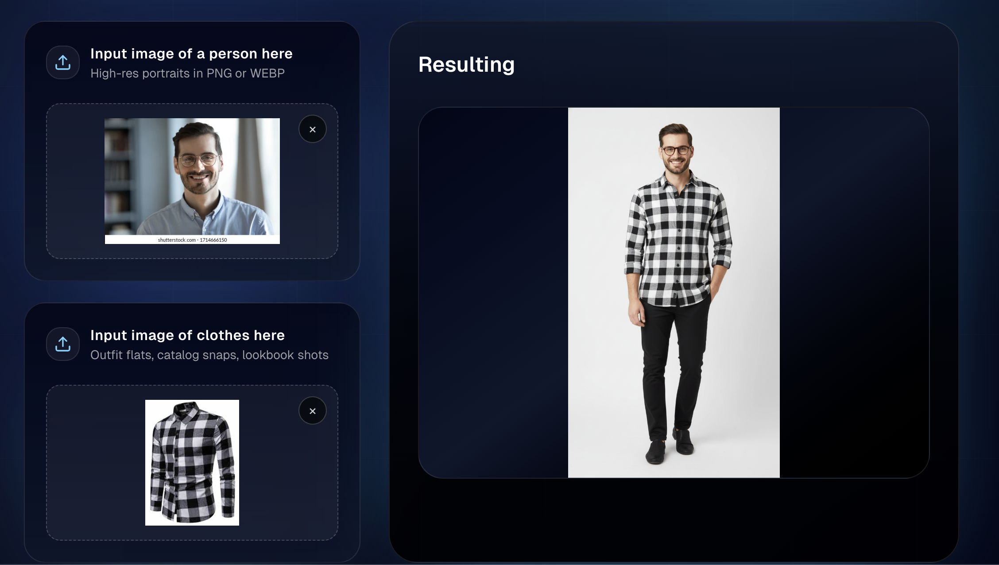
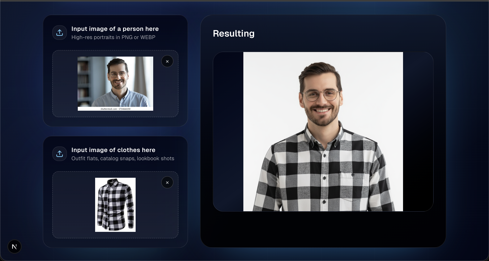
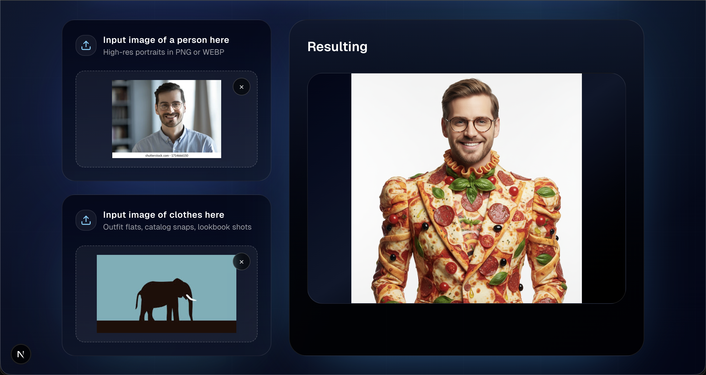
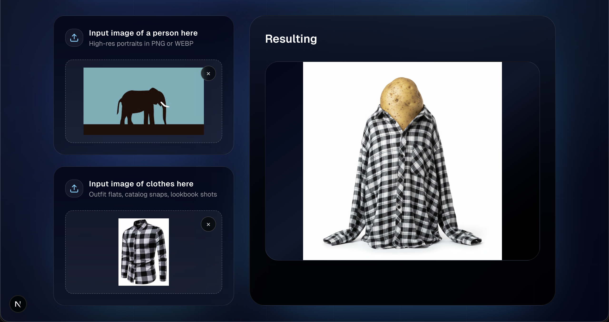
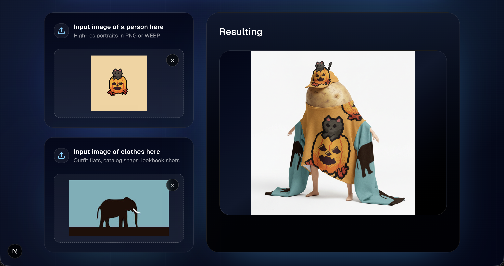

# Dress Up Darling — Virtual Try-On UI

Dress Up Darling is a Next.js 16 frontend for generating AI outfit renders. Upload a person photo and a garment image, choose your framing (square or portrait) and shot type (close-up or full body), provide an API key, and the app requests a generated composite from your backend.

## Features
- Dual upload panels with inline previews and clear buttons for person and garment images.
- Options menu to pick aspect ratio (`1:1` or `9:16`) and shot type (`close_up` or `full_body`).
- Animated, neon-inspired UI with framer-motion, loaders, and toast notifications.
- Result viewer that shows the generated image once the API responds.

## Prerequisites
- Node.js 18.18+ (20+ recommended).
- npm (bundled with Node). Yarn/pnpm/bun also work if you prefer.

## Setup
1) Install dependencies  
```bash
npm install
```

2) Configure environment  
Create a `.env.local` file with your backend base URL:
```bash
NEXT_PUBLIC_API_URL=https://backend.example.com
```

3) Run the dev server  
```bash
npm run dev
```
Then open http://localhost:3000.

## Using the app
1) Enter your API key in the top form.  
2) Upload a person image and a clothes image (PNG/WEBP recommended).  
3) (Optional) Click **Options** to adjust aspect ratio and shot type.  
4) Click **Initiate Styling**. The result card scrolls into view and shows the generated render when ready. Errors are surfaced via toasts.

## API contract (frontend expectation)
- Endpoint: `POST {NEXT_PUBLIC_API_URL}/images/generate-image`
- Payload:
  - `person_image_b64`: base64 string of the person image (no data URI prefix)
  - `clothes_image_b64`: base64 string of the garment image (no data URI prefix)
  - `shot_type`: `"close_up"` or `"full_body"`
  - `aspect_ratio`: `"1:1"` or `"9:16"`
  - `api_key`: string from the user input
- Success response: `{ status: "success", generated_image_b64: "<base64 png>" }`
- Non-200 responses should include a `message`; it is shown in a toast.

## Scripts
- `npm run dev` — start Next.js in development mode
- `npm run build` — production build
- `npm run start` — run the built app
- `npm run lint` — lint the codebase

## Key files
- `src/app/page.tsx` — main UI and request/preview logic.
- `eslint.config.mjs` — ESLint configuration.

## Screenshots & Examples

### Full Body Portrait


### Half Body Square


### Person Without Clothes


### No Person with Clothes


### No Person Without Clothes

